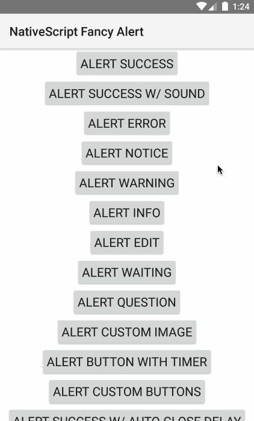

Fancy alerts for NativeScript.

Based on:

- iOS [SCLAlertView](https://github.com/dogo/SCLAlertView)
- Android [ColorDialog](https://github.com/andyxialm/ColorDialog)

# Install

```
npm install nativescript-fancyalert --save
```




# Usage

Just a few examples...

NOTE: Android supports a subset of some of these features, see [here](https://github.com/NathanWalker/nativescript-fancyalert/blob/master/fancyalert.android.ts) for supported methods and features.

```
import { TNSFancyAlert, TNSFancyAlertButton } from 'nativescript-fancyalert';

// show success
TNSFancyAlert.showSuccess('Success!', 'Fancy alerts are nice.', 'Yes they are!');

// set customizations
TNSFancyAlert.showAnimationType = TNSFancyAlert.SHOW_ANIMATION_TYPES.SlideInFromLeft;
TNSFancyAlert.hideAnimationType = TNSFancyAlert.HIDE_ANIMATION_TYPES.SlideOutToRight;
TNSFancyAlert.backgroundType = TNSFancyAlert.BACKGROUND_TYPES.Blur;
TNSFancyAlert.soundURL = 'bell.mp3';
TNSFancyAlert.showSuccess('Sound?', 'You can use sound and customize many aspects like animation in/out, color, background style and much more.', 'Amazing!');

// show custom image
TNSFancyAlert.showCustomImage('nativescript.png', '#2B33FF', 'Custom Image', `Using your own images is sure nice.`, 'Yes!');

// show custom button timer
TNSFancyAlert.showCustomButtonTimer(0, true, undefined, undefined, 'Mission Impossible', `This will self-destruct in 5 seconds.`, 'Ok');

// show custom buttons
let buttons = [
  new TNSFancyAlertButton({ label: 'One', action: () => { console.log('One'); } }),
  new TNSFancyAlertButton({ label: 'Two', action: () => { console.log('Two'); } }),
  new TNSFancyAlertButton({ label: 'Three', action: () => { console.log('Three'); } }),
  new TNSFancyAlertButton({ label: 'Four', action: () => { console.log('Four'); } }),
  new TNSFancyAlertButton({ label: 'Really? More?', action: () => { console.log('more'); } })
];
TNSFancyAlert.showCustomButtons(buttons, undefined, undefined, 'Got Buttons?', `Add as many as you'd like.`, 'Ok');

// show with custom width
TNSFancyAlert.showSuccess('Success!', 'This uses a custom width of 300.', `Oh that's nice.`, 0, 300);

// show textfield
TNSFancyAlert.showTextField('Enter your name', new TNSFancyAlertButton({ label: 'Save', action: (value: any) => { console.log(`User entered ${value}`);}}), undefined, undefined, 'User Input?', `Yeah, sure we can.`, 'Ok, lots of options.');

// show switch
TNSFancyAlert.showSwitch(`Don't show again`, '#58B136', new TNSFancyAlertButton({ label: 'Save', action: (isSelected: boolean) => { console.log(`Don't show again was selected: ${isSelected}`);}}), 'switch.png', '#B3714F', 'Need a switch?', `It can be useful.`, 'Got it.');
```

## TNSFancyAlert

#### Properties

Property |  Description
-------- | ---------
`TNSFancyAlert.SUPPORTED_TYPES: SUPPORTED_TYPESI` | Different supported style types.
`TNSFancyAlert.shouldDismissOnTapOutside: boolean` | Should dismiss when tapped outside.
`TNSFancyAlert.hideAnimationType: HIDE_ANIMATION_TYPESI` | Use `TNSFancyAlert.HIDE_ANIMATION_TYPES` to set. Supports: FadeOut, SlideOutToBottom, SlideOutToTop, SlideOutToLeft, SlideOutToRight, SlideOutToCenter, SlideOutFromCenter.
`TNSFancyAlert.showAnimationType: SHOW_ANIMATION_TYPESI` | Use `TNSFancyAlert.SHOW_ANIMATION_TYPES` to set. Supports: FadeIn, SlideInFromBottom, SlideInFromTop, SlideInFromLeft, SlideInFromRight, SlideInFromCenter, SlideInToCenter.
`TNSFancyAlert.backgroundType: BACKGROUND_TYPESI` | Use `TNSFancyAlert.BACKGROUND_TYPES` to set. Supports: Shadow, Blur, Transparent.
`TNSFancyAlert.customViewColor: string` | Overwrite (Buttons, top circle and borders) colors.
`TNSFancyAlert.iconTintColor: string` | Set custom tint color for icon image.
`TNSFancyAlert.titleColor: string` | Set custom title color.
`TNSFancyAlert.bodyTextColor: string` | Set custom body text color.
`TNSFancyAlert.tintTopCircle: string` | Override top circle tint color with background color
`TNSFancyAlert.cornerRadius: number` | Set custom corner radius.
`TNSFancyAlert.backgroundViewColor: string` | Overwrite background color
`TNSFancyAlert.useLargerIcon: boolean` | Make the top circle icon larger
`TNSFancyAlert.soundURL: string` | Use mp3 from App_Resources when alert shows.

#### Methods

* `showSuccess(title: string, subTitle?: string, closeBtnTitle?: string, duration?: number, width?: number)`
* `showError(title: string, subTitle?: string, closeBtnTitle?: string, duration?: number, width?: number)`
* `showNotice(title: string, subTitle?: string, closeBtnTitle?: string, duration?: number, width?: number)`
* `showWarning(title: string, subTitle?: string, closeBtnTitle?: string, duration?: number, width?: number)`
* `showInfo(title: string, subTitle?: string, closeBtnTitle?: string, duration?: number, width?: number)`
* `showEdit(title: string, subTitle?: string, closeBtnTitle?: string, duration?: number, width?: number)`
* `showWaiting(title: string, subTitle?: string, closeBtnTitle?: string, duration?: number, width?: number)`
* `showQuestion(title: string, subTitle?: string, closeBtnTitle?: string, duration?: number, width?: number)`
* `showCustomButtonTimer(buttonIndex: number, reverse?: boolean, imageName?: string, color?: string, title?: string, subTitle?: string, closeBtnTitle?: string, duration?: number, width?: number)`
* `showCustomImage(imageName: string, color: string, title: string, subTitle?: string, closeBtnTitle?: string, duration?: number, width?: number)`
* `showCustomButtons(buttons: Array<TNSFancyAlertButton>, imageName: string, color: string, title: string, subTitle?: string, closeBtnTitle?: string, duration?: number, width?: number)`
* `showCustomTextAttributes(attributionBlock: Function, button: TNSFancyAlertButton, imageName: string, color: string, title: string, subTitle?: string, closeBtnTitle?: string, duration?: number, width?: number)`
* `showTextField(placeholder: string, initialValue: string, button: TNSFancyAlertButton, imageName: string, color: string, title: string, subTitle?: string, closeBtnTitle?: string, duration?: number, width?: number)`
* `showSwitch(switchLabel: string, switchColor: string, button: TNSFancyAlertButton, imageName: string, color: string, title: string, subTitle?: string, closeBtnTitle?: string, duration?: number, width?: number)`
* `showCustomView(customView: any, imageName?: string, color?: string, title?: string, subTitle?: string, closeBtnTitle?: string, duration?: number, width?: number)`
* `show(type: string, title: string, subTitle?: string, closeBtnTitle?: string, duration?: number, width?: number)`
* `showCustom(alert: any, imageName: string, color: string, title?: string, subTitle?: string, closeBtnTitle?: string, duration?: number)`
* `createAlert(width?: number)`

## Why the TNS prefixed name?

`TNS` stands for **T**elerik **N**ative**S**cript

iOS uses classes prefixed with `NS` (stemming from the [NeXTSTEP](https://en.wikipedia.org/wiki/NeXTSTEP) days of old):
https://developer.apple.com/library/mac/documentation/Cocoa/Reference/Foundation/Classes/NSString_Class/

To avoid confusion with iOS native classes, `TNS` is used instead.

## License

MIT
